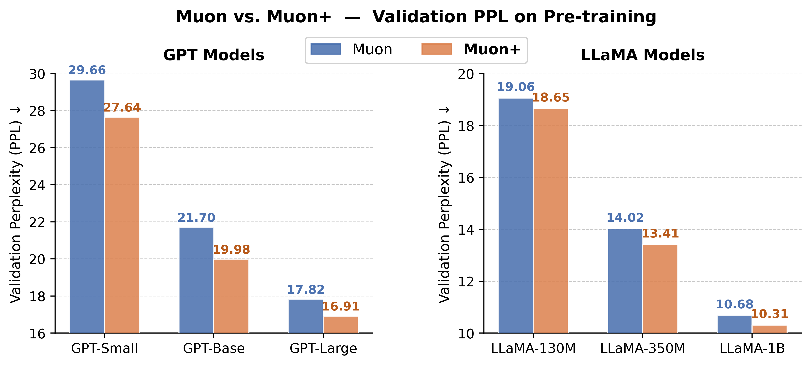
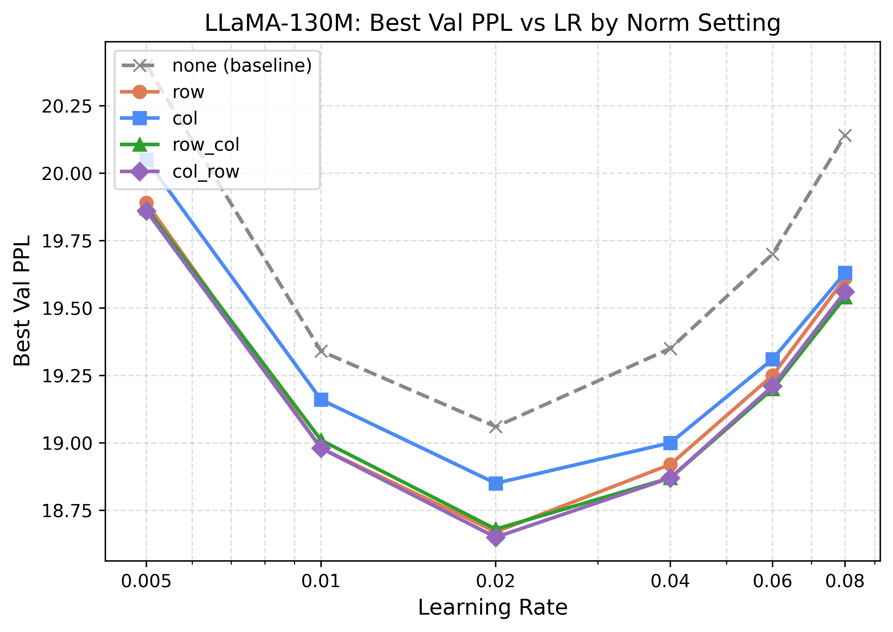
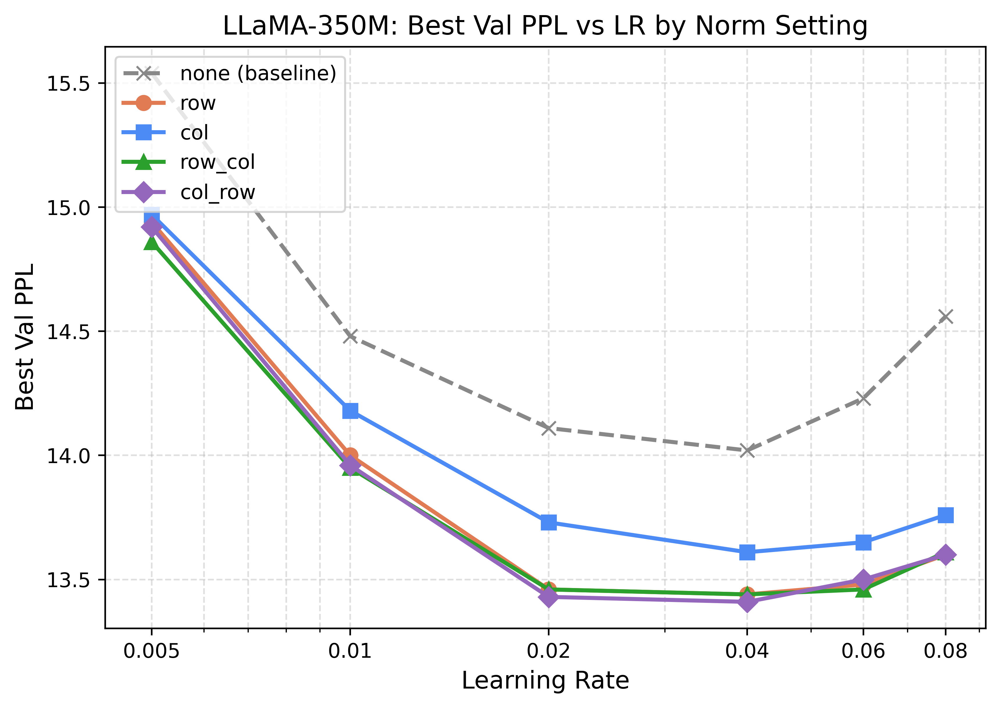
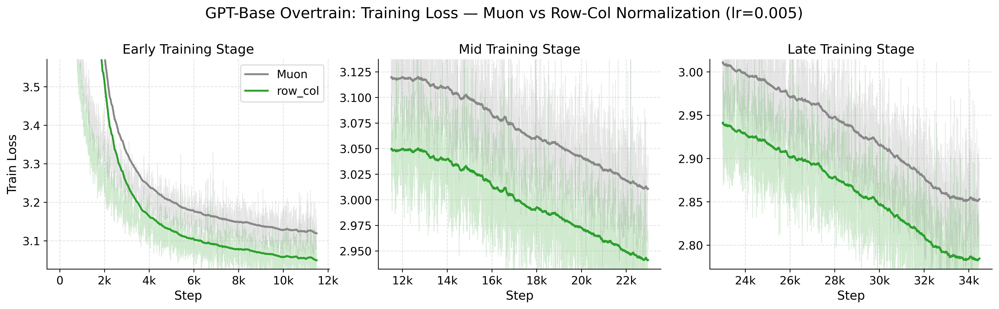
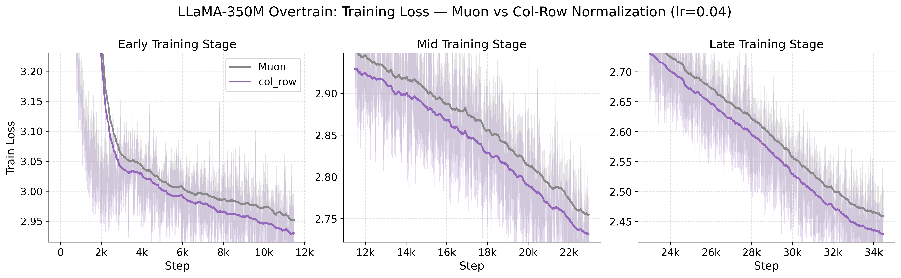

# MuonPlus

**MuonPlus** extends the [Muon optimizer](https://github.com/KellerJordan/Muon) by adding optional post-polar normalization to the update matrix. After polar factorization, each weight update can be column-wise, row-wise, or jointly normalized. Check our paper here [Muon+](https://arxiv.org/abs/2602.21545).

## Method

Standard Muon computes the update as the polar factor of the momentum-accumulated gradient:

```
u = polar(g)   →   θ ← θ - lr · u
```

MuonPlus adds an optional normalization step after polar factorization:

```
u = polar(g)
u = normalize(u, mode)   # new
θ ← θ - lr · u
```

**Available `norm_mode` options:**

| `norm_mode` | Operation |
|---|---|
| `none` | No normalization (identical to Muon) |
| `col` | Each column divided by its L2 norm |
| `row` | Each row divided by its L2 norm |
| `col_row` | Column normalization, then row normalization |
| `row_col` | Row normalization, then column normalization |

**Polar factorization backends** (`polar_method`):

| Method | Description |
|---|---|
| `Keller` | Newton-Schulz iteration (fixed coefficients, original Muon) |
| `Jiacheng` | Newton-Schulz iteration with per-step optimized coefficients |
| `svd-exact` | Exact SVD polar decomposition |
| `polarexpress` | [PolarExpress](https://arxiv.org/abs/2505.16932) |

Non-matrix parameters (embeddings, biases, LM head) are updated with AdamW.

---

## Results

### Consistent gains across scales and architectures

Muon+ consistently outperforms Muon on both GPT (124M–774M) and LLaMA (60M–1B) models under compute-optimal training (T2P ≈ 20).



| Model | Muon PPL | Muon+ PPL | Δ |
|---|---|---|---|
| GPT-Small (124M) | 29.66 | **27.64** | −2.02 |
| GPT-Base (362M) | 21.70 | **19.98** | −1.72 |
| GPT-Large (774M) | 17.82 | **16.91** | −0.91 |
| LLaMA-130M | 19.06 | **18.65** | −0.41 |
| LLaMA-350M | 14.02 | **13.41** | −0.61 |
| LLaMA-1B | 10.68 | **10.31** | −0.37 |

### Robustness to learning rate

Muon+ variants (col, row, col\_row, row\_col) consistently beat the Muon baseline across all learning rates. Notably, at large learning rates where Muon degrades sharply, Muon+ remains stable.

<p align="center">
  
  
</p>

### Sustained gains in long-horizon overtraining (T2P ≈ 200)

Muon+ maintains its advantage throughout 72B token overtraining runs on both GPT-Base and LLaMA-350M, with the performance gap stable across early, mid, and late training stages.

| Model | Tokens | Muon PPL | Muon+ PPL | Δ |
|---|---|---|---|---|
| GPT-Base (362M) | 72B | 16.97 | **15.84** | −1.13 |
| LLaMA-350M (368M) | 72B | 11.48 | **11.03** | −0.45 |




---

## Data Preparation

Data is pre-tokenized and saved as binary shards before training. Supported datasets:

| Name | Source |
|---|---|
| `fineweb10B` | `HuggingFaceFW/fineweb` (10BT sample) |
| `fineweb100B` | `HuggingFaceFW/fineweb` (100BT sample) |
| `fineweb_edu10B` | `HuggingFaceFW/fineweb-edu` (10BT sample) |
| `wikitext` | `wikitext-103-v1` |

**Step 1: Tokenize and save shards**

```bash

# For GPT models (GPT-2 tokenizer)
python process_data.py --name fineweb10B --tokenizer gpt2 --shard_size 100000000

# For LLaMA models (Llama-2 tokenizer)
python process_data.py --name fineweb100B --tokenizer llama2 --shard_size 100000000

```

Arguments:
- `--name`: dataset name (see table above)
- `--tokenizer`: `gpt2` | `llama2` | `llama3` | `meta-llama/<model-id>`
- `--shard_size`: tokens per shard (default: `1e8`)
- `--nprocs`: number of parallel workers (default: `N_CPU - 2`)

Shards are saved as `.bin` files in `DATA_DIR/<name>-<tokenizer>/`. Set `DATA_DIR` in `utils/dataloader.py` to your data directory.

**Step 2: Verify shards**

The dataloader expects:
- Training shards: files containing `train` in the filename
- Validation shards: files containing `val` in the filename

---

## Training

Edit the `logging_params` in your config to point `ckpt_dir` and `results_dir` to your output directories, then launch with `torchrun`:

```bash
# Single node, 2 GPUs, without normalization
CUDA_VISIBLE_DEVICES=0,1 torchrun --standalone --nproc_per_node=2 \
    run.py --config configs/gpt_small_none.yaml --prefix my_run

# Single GPU, with col_row normalization
python run.py --config configs/gpt_small_col_row.yaml --prefix my_run
```

`--prefix` and `--suffix` are prepended/appended to the W&B run name.

---

## Configuration

All settings are controlled via YAML. Example (`configs/llama60M_row-col.yaml`):

```yaml
optimizer_params:
  - name: muon-plus
    lr: [0.04]
    weight_decay: 0.05
    lr_schedule: warm-up-cosine
    warm_up_fraction: 0.1
    ns_steps: 5
    polar_method: Keller
    rms_scaling: True
    norm_mode: row_col    # none | col | row | col_row | row_col
    norm_eps: 1.0e-8

training_params:
  tokens_processed: 524288
  batch_size: 64
  context_length: 1024
  mixed_precision: bfloat16
  compile: True

logging_params:
  ckpt_dir: "outputs/checkpoints"
  results_dir: "outputs/results"
  wandb:
    project: "MuonPlus"
    dir: "outputs/wandb"

model_config:
  model_type: llama      # llama | gpt
  n_embd: 512
  n_layer: 8
  n_head: 8
  vocab_size: 32000
  intermediate_size: 1376
  flash_attention: True

dataset:
  name: "fineweb100B"
  tokenizer: "Llama-2-7b-hf"
  total_tokens_B: 1.1
```
---

## Acknowledgements

- Muon optimizer: [KellerJordan/Muon](https://github.com/KellerJordan/Muon)
- Training framework based on [modded-nanogpt](https://github.com/KellerJordan/modded-nanogpt) and [build-nanogpt](https://github.com/karpathy/build-nanogpt)
